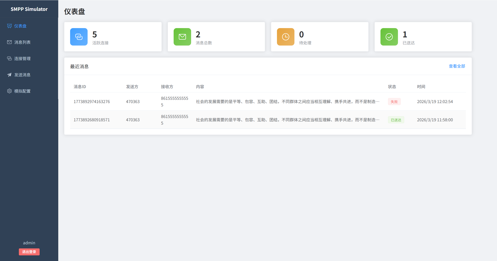
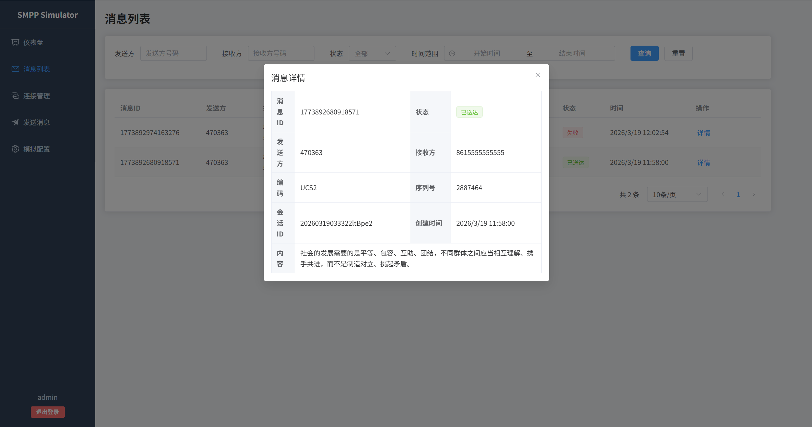
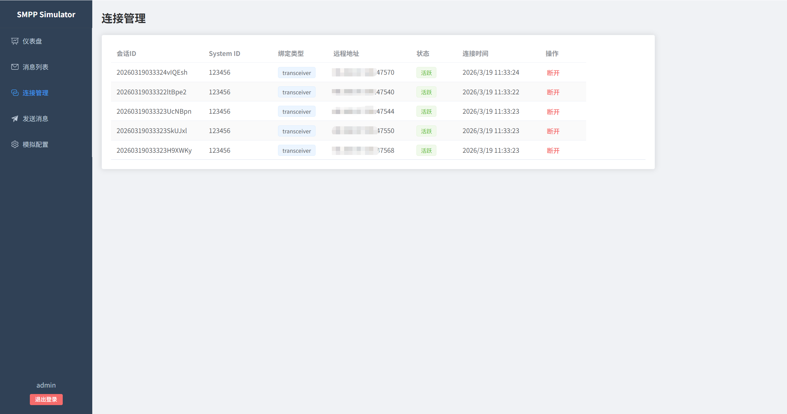
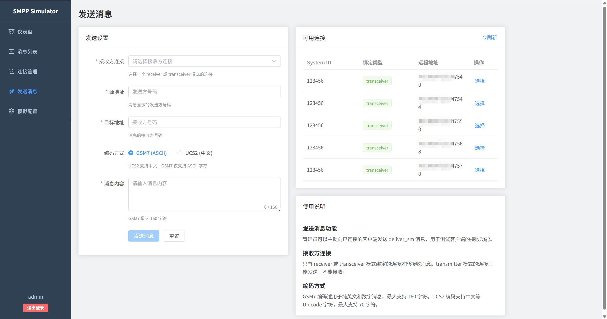
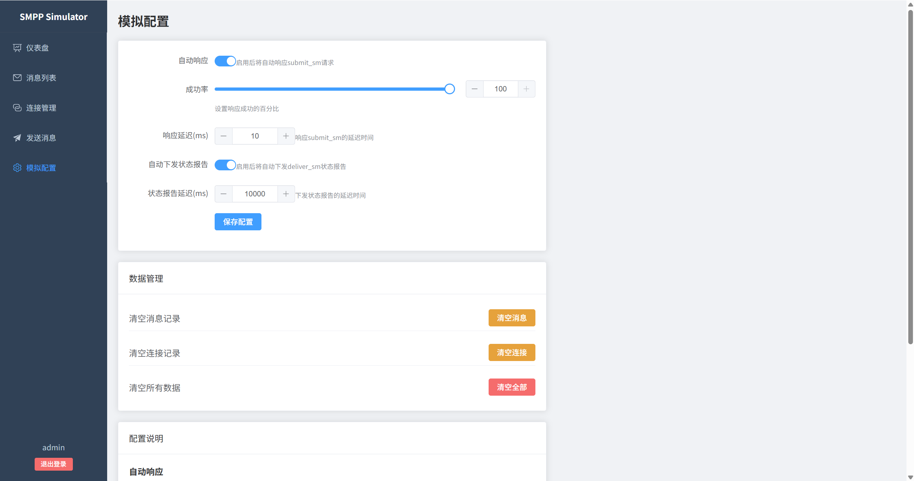

# SMPP Simulator

SMPP 短信模拟器，为短信平台提供 SMPP 协议功能测试环境。

## 功能特性

- SMPP 协议服务端（TCP 2775 端口）
- REST API 管理接口
- WebSocket 实时推送
- 用户认证与权限控制
- 可配置的模拟行为
 - Docker 部署支持
- **移动端适配** - 响应式设计，支持手机访问
- **深色模式** - 支持亮色/暗色主题切换
- **国际化** - 支持中英文切换
- **消息搜索** - 支持内容、状态、时间范围搜索
- **消息导出** - 支持 CSV/JSON 格式导出
- **批量操作** - 支持批量删除消息
- **消息模板** - 预定义常用消息模板
- **连接统计** - 查看连接的消息统计
- **API 限流可视化** - 显示剩余登录次数
- **移动端适配** - 响应式设计，支持手机访问
- **深色模式** - 支持亮色/暗色主题切换
- **国际化** - 支持中英文切换
- **消息搜索** - 支持内容模糊搜索
- **消息导出** - 支持 CSV/JSON 格式导出
- **批量操作** - 支持批量删除消息
- **消息模板** - 预定义常用消息模板
- **连接统计** - 查看连接消息统计
- **API 限流可视化** - 显示剩余登录次数
- **移动端适配** - 响应式设计，支持手机访问
- **深色模式** - 支持亮色/深色主题切换
- **国际化** - 支持中英文切换
- **消息模板** - 预定义常用消息模板

## 界面预览

|          仪表盘          |          消息列表          |
|:---------------------:|:----------------------:|
|  |  |

|          连接管理          |          发送消息          |
|:----------------------:|:----------------------:|
|  |  |

|          模拟配置          |                    |
|:----------------------:|:----------------------:|
|  |  |

## 快速开始

### Docker 部署（推荐）

```bash
docker-compose up -d
```

服务启动后：
- SMPP 端口：2775
- HTTP API：8080
- 前端界面：80

### 本地开发

**后端：**
```bash
cd backend
go mod download
go run cmd/server/main.go
```

**前端：**
```bash
cd frontend
pnpm install
pnpm dev
```

## 配置说明

### 配置方式

支持三种配置方式，优先级从高到低：

1. **环境变量** - 最高优先级，适合容器化部署
2. **配置文件** - YAML 格式，适合本地开发
3. **默认值** - 兜底配置

### 配置文件

复制配置模板并修改：

```bash
cd backend
cp config.example.yaml config.yaml
```

配置项说明：

```yaml
# SMPP Server
smpp_host: "0.0.0.0"      # SMPP 监听地址
smpp_port: "2775"          # SMPP 监听端口

# HTTP Server
http_host: "0.0.0.0"       # HTTP 监听地址
http_port: "8080"          # HTTP 监听端口

# Database
db_path: "./smpp.db"       # SQLite 数据库路径

# Auth
admin_password: "admin123"           # 管理员密码（生产环境请修改）
jwt_secret: "your-secret-key"        # JWT 密钥（生产环境请修改）
jwt_expiry: 24                       # Token 有效期（小时）

# Security
cors_origins: "*"                    # 允许的 CORS 来源（生产环境请修改）
login_rate_limit: 5                  # 每分钟最大登录尝试次数
```

### 环境变量

所有配置项均可通过环境变量覆盖：

| 环境变量 | 说明 | 默认值 |
|----------|------|--------|
| `SMPP_HOST` | SMPP 监听地址 | 0.0.0.0 |
| `SMPP_PORT` | SMPP 监听端口 | 2775 |
| `HTTP_HOST` | HTTP 监听地址 | 0.0.0.0 |
| `HTTP_PORT` | HTTP 监听端口 | 8080 |
| `DB_PATH` | 数据库路径 | ./smpp.db |
| `ADMIN_PASSWORD` | 管理员密码 | admin123 |
| `JWT_SECRET` | JWT 密钥 | smpp-simulator-secret-key |
| `JWT_EXPIRY` | Token 有效期(小时) | 24 |
| `CORS_ORIGINS` | 允许的 CORS 来源（逗号分隔） | * |
| `LOGIN_RATE_LIMIT` | 每分钟最大登录尝试次数 | 5 |
| `CONFIG_PATH` | 指定配置文件路径 | 自动查找 |

### Docker 环境变量示例

```yaml
# docker-compose.yml
services:
  backend:
    environment:
      - ADMIN_PASSWORD=your-secure-password
      - JWT_SECRET=your-jwt-secret
```

## 用户认证

### 权限说明

| 页面 | 未登录 | 已登录 |
|------|:------:|:------:|
| 仪表盘 | ✅ | ✅ |
| 消息列表 | ✅ | ✅ |
| 连接管理 | ❌ | ✅ |
| 模拟配置 | ❌ | ✅ |

### 登录信息

- 用户名：`admin`
- 默认密码：`admin123`（可通过配置修改）

## API 接口

### 公开接口（无需认证）

| 方法 | 路径 | 说明 |
|------|------|------|
| POST | /api/auth/login | 登录获取 Token |
| GET | /api/auth/status | 检查 Token 状态 |
| GET | /api/stats | 统计数据 |
| GET | /api/messages | 消息列表 |
| GET | /api/messages/:id | 消息详情 |

### 受保护接口（需要认证）

请求时需在 Header 中携带 Token：

```
Authorization: Bearer <token>
```

| 方法 | 路径 | 说明 |
|------|------|------|
| GET | /api/sessions | 连接列表 |
| GET | /api/sessions/:id/stats | 连接消息统计 |
| DELETE | /api/sessions/:id | 断开连接 |
| DELETE | /api/messages/batch | 批量删除消息 |
| POST | /api/messages/:id/deliver | 触发状态报告 |
| POST | /api/messages/:id/fail | 标记消息失败 |
| GET | /api/mock/config | 获取模拟配置 |
| PUT | /api/mock/config | 更新模拟配置 |
| DELETE | /api/data/messages | 清空所有消息 |
| DELETE | /api/data/sessions | 清空所有会话 |
| DELETE | /api/data/all | 清空所有数据 |
| GET | /api/send/receivers | 获取可接收消息的会话 |
| POST | /api/send | 发送消息到会话 |
| GET | /api/templates | 获取消息模板列表 |
| POST | /api/templates | 创建消息模板 |
| PUT | /api/templates/:id | 更新消息模板 |
| DELETE | /api/templates/:id | 删除消息模板 |
| GET | /api/system/config | 获取系统配置 |
| PUT | /api/system/config | 更新系统配置 |
| GET | /api/stats/rate-limit | 获取限流状态 |

### WebSocket

连接地址：`ws://host/ws`

**认证方式（可选）：**
- Query 参数：`ws://host/ws?token=<jwt>`
- Header：`Authorization: Bearer <token>`

如果不提供 token，将以匿名方式连接。

事件类型：
- `session_connect` - 新连接建立
- `session_disconnect` - 连接断开
- `message_received` - 收到消息
- `message_delivered` - 消息已送达

### 发送消息

请求体示例（`POST /api/send`）：

```json
{
  "session_id": "session-uuid",
  "source_addr": "10086",
  "dest_addr": "13800138000",
  "content": "消息内容",
  "encoding": "GSM7"
}
```

`encoding` 可选值：`GSM7`（默认）或 `UCS2`

### 健康检查

| 方法 | 路径 | 说明 |
|------|------|------|
| GET | /health | 健康检查端点 |

## API 文档

项目包含完整的 OpenAPI 3.0 规范文档：

- 文件位置：`docs/openapi.yaml`
- 可使用 [Swagger UI](https://swagger.io/tools/swagger-ui/) 或 [Redoc](https://github.com/Redocly/redoc) 查看

在线查看：
```bash
# 使用 Redoc
npx redocly preview-docs docs/openapi.yaml

# 或使用 Swagger UI
npx swagger-ui-watcher docs/openapi.yaml
```

## 使用说明

1. 配置短信平台连接到 `localhost:2775`
2. 使用任意 system_id 和 password 进行 SMPP 绑定
3. 发送 submit_sm 请求进行测试
4. 通过前端界面查看消息和连接状态

## SMPP 协议支持

### 支持的 PDU

| 命令 | 说明 |
|------|------|
| bind_transmitter | 发送者绑定 |
| bind_receiver | 接收者绑定 |
| bind_transceiver | 收发者绑定 |
| unbind | 解除绑定 |
| submit_sm | 提交短信 |
| deliver_sm | 送达报告 |
| enquire_link | 心跳检测 |

### 消息编码

| data_coding | 编码 | 支持状态 |
|-------------|------|:--------:|
| 0 | GSM7/ASCII | ✅ |
| 8 | UCS2 (UTF-16BE) | ✅ |

## 安全配置

### 生产环境清单

在生产环境中，请务必修改以下配置：

| 配置项 | 风险 | 修改方式 |
|--------|------|----------|
| `ADMIN_PASSWORD` | 默认密码 `admin123` | 环境变量或配置文件 |
| `JWT_SECRET` | 默认密钥可被破解 | 设置为随机强密码 |
| `CORS_ORIGINS` | 默认 `*` 允许所有来源 | 设置为实际域名 |

### 安全特性

- **登录速率限制**：默认每 IP 每分钟最多 5 次登录尝试，防止暴力破解
- **WebSocket Origin 验证**：仅允许白名单域名连接
- **Docker 非 root 运行**：容器以 `smpp` 用户运行，降低安全风险
- **JWT Token 过期**：默认 24 小时过期

### 配置示例

```yaml
# docker-compose.yml (生产环境)
services:
  backend:
    environment:
      - ADMIN_PASSWORD=your-strong-password-here
      - JWT_SECRET=your-random-jwt-secret-at-least-32-chars
      - CORS_ORIGINS=https://your-domain.com
      - LOGIN_RATE_LIMIT=3
```

## 生产部署

### 编译

```bash
cd backend

# Linux
CGO_ENABLED=1 go build -o smpp-simulator ./cmd/server

# Windows
go build -o smpp-simulator.exe ./cmd/server
```

### 前端构建

```bash
cd frontend
pnpm install
pnpm build
# 构建产物在 dist/ 目录
```

### Nginx 配置

```nginx
server {
    listen 80;
    server_name your-domain.com;

    # 前端静态文件
    location / {
        root /path/to/smpp-simulator/frontend/dist;
        try_files $uri $uri/ /index.html;
    }

    # API 代理
    location /api {
        proxy_pass http://127.0.0.1:8080;
        proxy_set_header Host $host;
        proxy_set_header X-Real-IP $remote_addr;
    }

    # WebSocket 代理
    location /ws {
        proxy_pass http://127.0.0.1:8080;
        proxy_http_version 1.1;
        proxy_set_header Upgrade $http_upgrade;
        proxy_set_header Connection "upgrade";
        proxy_set_header Host $host;
        proxy_read_timeout 3600s;
        proxy_send_timeout 3600s;
    }
}
```

### Systemd 服务

创建 `/etc/systemd/system/smpp-simulator.service`：

```ini
[Unit]
Description=SMPP Simulator
After=network.target

[Service]
Type=simple
User=www-data
WorkingDirectory=/opt/smpp-simulator
ExecStart=/opt/smpp-simulator/smpp-simulator
Restart=on-failure
RestartSec=5

[Install]
WantedBy=multi-user.target
```

启动服务：

```bash
systemctl daemon-reload
systemctl enable smpp-simulator
systemctl start smpp-simulator
```

## 技术栈

- **后端**：Go + Gin + SQLite
- **前端**：Vue 3 + TypeScript + Element Plus + Pinia
- **部署**：Docker + docker-compose

## License

MIT
